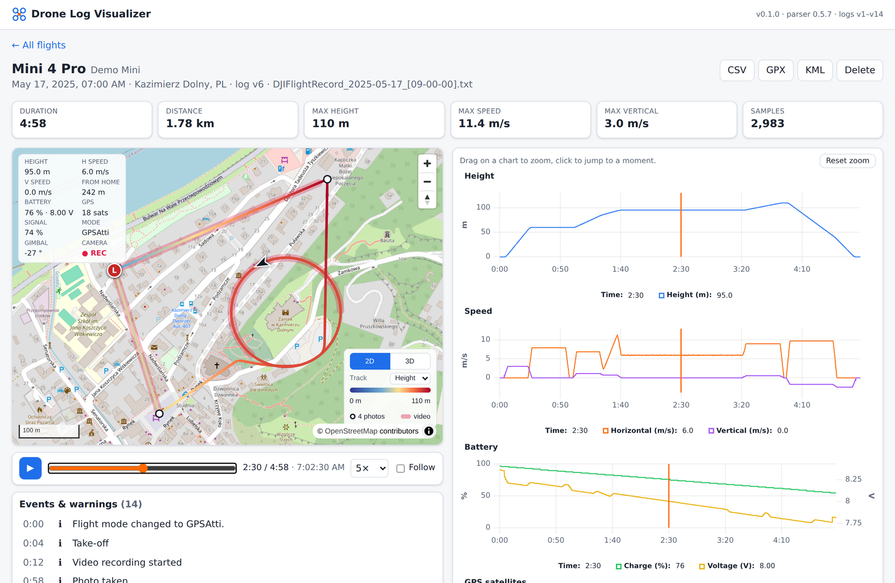
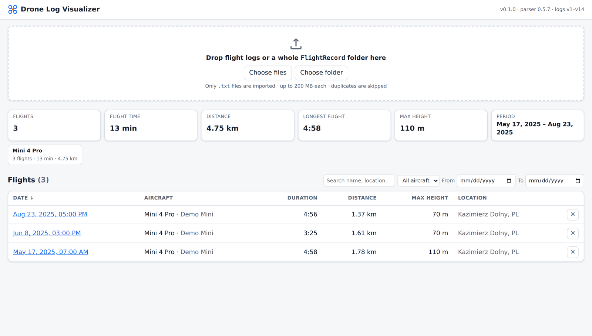
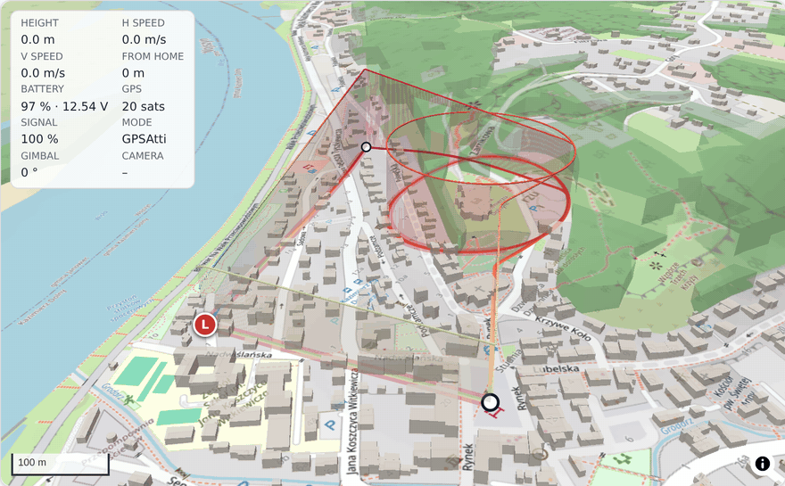
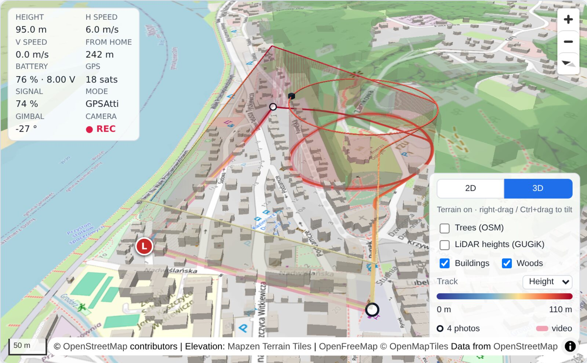
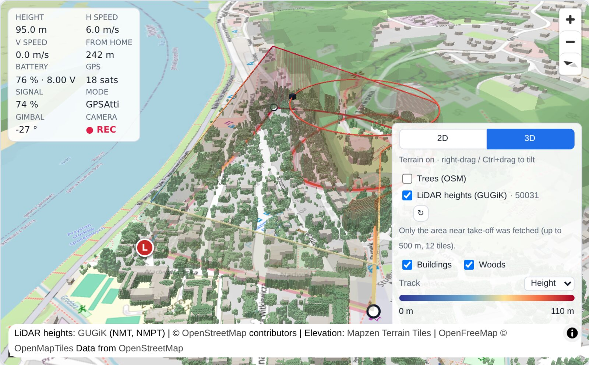
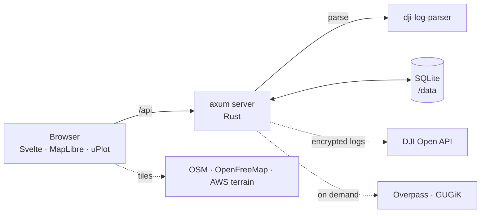

<div align="center">

# Drone Log Visualizer

**A viewer for DJI drone flight logs: on a map, in 3D and on charts. Self-hosted, runs in a single Docker container.**

<sub>Independent open-source project. Not affiliated with, endorsed or sponsored by DJI.</sub>

[](https://github.com/jakub-m-arch/drone-log-visualizer/actions/workflows/ci.yml)
[](LICENSE)


[Quick start](#quick-start) ·
[Tour](#a-quick-tour) ·
[DJI API key](#dji-api-key-for-encrypted-logs) ·
[Privacy](#privacy-what-leaves-your-machine) ·
[Configuration](#configuration) ·
[FAQ](#troubleshooting--faq) ·
[Development](#development)

<picture>
  <source media="(prefers-color-scheme: dark)" srcset="docs/screenshots/flight-view-dark.png">
  
</picture>
<sub>Synthetic demo flight. Map data © <a href="https://www.openstreetmap.org/copyright">OpenStreetMap</a> contributors.</sub>

</div>

Drop the `FlightRecord` folder from your phone or controller onto the page to
see every flight on a map, replay it in 3D over real terrain and buildings, and
read height, speed, battery, GPS and signal on synchronized charts. Your logs
stay on your computer: there is no account, no cloud and no telemetry.

> [!TIP]
> No drone at hand? [`samples/`](samples) holds three synthetic flights over
> Kazimierz Dolny, the same ones as in the screenshots. Drop the folder onto
> the page. They are generated, not recorded, and model a sub-250 g Mini 4 Pro
> (class C0). Before a real flight like this, check the local geozones, e.g. on
> [DroneMap](https://dronemap.pansa.pl/) in Poland.

## Highlights

- 🗺️ **Map and 3D replay.** The track on OpenStreetMap, colored by height, speed or
  battery. In 3D it is a ribbon at real height over terrain, 3D buildings and woods.
- 📈 **Synchronized charts.** Height, speed, battery (% and V), GPS satellites,
  gimbal pitch and RC signal. Drag to zoom, click to jump, play back at 1×–50×.
- 🌳 **Real obstacle heights.** On demand, single trees from OSM and, in Poland,
  the height of every tree and building from GUGiK airborne laser scanning (LiDAR).
- 📂 **Bulk import.** Drop a whole folder. Duplicates are skipped, errors are
  grouped by cause, and you get totals per aircraft.
- 📤 **Export** any flight to CSV, GPX or KML.
- 🔐 **Private by design.** Self-hosted. Your DJI key is only read from the
  environment and is never logged, stored or returned by the API.
- 🧾 **All log formats v1–v14**, including encrypted logs from current DJI apps
  (with your own free DJI developer key).

## Quick start

You need Docker with the Compose plugin.

```sh
git clone https://github.com/jakub-m-arch/drone-log-visualizer.git
cd drone-log-visualizer
cp .env.example .env        # optional: add your DJI_API_KEY (see below)
docker compose up -d --build
```

Open **<http://localhost:8080>** and drop flight logs, or a whole `FlightRecord`
folder, onto the page.

| | |
| --- | --- |
| Update | `git pull && docker compose up -d --build --remove-orphans` |
| Stop | `docker compose down` (keeps your data) |
| Remove everything | `docker compose down -v --rmi all` (deletes flights, cached keys and the image) |

Everything is stored in SQLite in the `dji-data` Docker volume, mounted at `/data`.

> [!NOTE]
> The project was called *DJI Flight Log Viewer* before. Updating from that
> version keeps your flights: the volume name is unchanged, and
> `--remove-orphans` removes the old container.

## A quick tour

### All flights at a glance

Totals across all flights (count, flight time, distance, longest flight, max
height and period), a breakdown per aircraft, and a list you can filter by
aircraft, date and text and sort by any column.

<picture>
  <source media="(prefers-color-scheme: dark)" srcset="docs/screenshots/flight-list-dark.png">
  
</picture>

### Replay in 3D

Switch to **3D** to see the track as a ribbon at its real height, with a
translucent curtain down to the ground. It sits over terrain from free
elevation data, with 3D buildings and woods from OpenStreetMap. Press play,
or drag the timeline, and the aircraft moves along the track while the
telemetry panel and the charts follow it.

<p align="center">
  
</p>


<sub>Synthetic demo flight. Map data © <a href="https://www.openstreetmap.org/copyright">OpenStreetMap</a> contributors,
<a href="https://openfreemap.org/">OpenFreeMap</a>, © <a href="https://openmaptiles.org/">OpenMapTiles</a>.
Elevation: <a href="https://github.com/tilezen/joerd/blob/master/docs/attribution.md">Mapzen Terrain Tiles</a> (AWS Open Data).</sub>

### Real obstacle heights from LiDAR (Poland)

Turn on **LiDAR heights (GUGiK)** and the server fetches the national terrain
and surface models from airborne laser scanning around the take-off point. The
difference between them is the real height of every tree, roof and mast,
drawn as 1 m blocks. In this example, 50,031 blocks render the trees around the
castle hill that OpenStreetMap does not have.


<sub>Object heights: <a href="https://www.geoportal.gov.pl/">GUGiK</a>, numerical terrain model (NMT) and numerical surface model (NMPT).
Map data © <a href="https://www.openstreetmap.org/copyright">OpenStreetMap</a> contributors, OpenFreeMap, © OpenMapTiles.
Elevation: Mapzen Terrain Tiles.</sub>

## Features

**Import**
- Drag & drop single logs or a whole `FlightRecord` folder (subfolders included),
  or use the file/folder pickers.
- Batch progress, with errors grouped by cause.
- Re-imports are de-duplicated by content. When the app learns to read more
  data, dropping the folder again re-parses the stored flights in place.

**Flight list**
- Totals (flights, flight time, distance, longest flight, max height, period)
  and a per-aircraft breakdown.
- Filter by aircraft, date range and text. Sort by date, duration, distance or height.

**Flight view**
- Track on OpenStreetMap with take-off, landing and home point, optionally
  colored by height, speed or battery.
- Photo positions and video-recording sections are marked on the track.
- Live telemetry panel: height, speeds, distance from home, battery, GPS,
  signal, flight mode, gimbal and camera state.
- Timeline and playback (1×–50×), with an optional follow mode. Keys: <kbd>Space</kbd>
  plays or pauses, <kbd>←</kbd> / <kbd>→</kbd> jump 5 s (30 s with <kbd>Shift</kbd>).
- Synchronized [uPlot](https://github.com/leeoniya/uPlot) charts. Legends show
  the values at the playhead.
- Events list: app warnings and tips, take-off and landing, photos, video
  start/stop. Click an event to jump to it.

**3D**
- Ribbon and curtain at real height over terrain, or over flat ground if you turn terrain off.
- 3D buildings and woods from OpenStreetMap.
- On demand: single trees from OSM and LiDAR object heights for Poland
  (see [3D and obstacle data](#3d-and-obstacle-data)).

**Export**
- CSV (all telemetry columns), GPX (track with time and elevation) and KML
  (3D track for Google Earth).

## Where to find your flight logs

| App | Location |
| --- | --- |
| DJI Fly (Android) | `Android/data/dji.go.v5/files/FlightRecord/` |
| DJI Fly (iOS) | Finder / iTunes → File Sharing → DJI Fly → `FlightRecords` |
| DJI GO 4 (Android) | `DJI/dji.go.v4/FlightRecord/` |
| DJI RC / RC Pro (screen controllers) | connect via USB → `Android/data/dji.go.v5/files/FlightRecord/` |

Logs are named like `DJIFlightRecord_2025-05-17_[09-00-00].txt`. Paths can
differ between app versions. Copy the whole folder and drop it onto the page.

## DJI API key (for encrypted logs)

Logs written by current DJI apps (format **v13 and newer**) are encrypted.
DJI's Open API issues the keys for each specific log, so you need a free DJI
developer **App Key**. Older logs (v1–v12) and the samples work without one.

1. Sign in at [developer.dji.com](https://developer.dji.com/user) (a regular DJI account works).
2. Click **Create App**, choose **Open API** as the app type, and fill in name,
   category and description.
3. Activate the app via the link DJI sends by e-mail.
4. On your developer page, open the app and copy its **App Key**.
5. Put it in `.env` next to `docker-compose.yml`:

   ```sh
   DJI_API_KEY=your-app-key
   ```

6. Restart with `docker compose up -d`. The yellow banner on the start page disappears.

> [!IMPORTANT]
> **Use your own key.** Each user of this project runs it with their own DJI
> developer account and App Key, and is responsible for using it in line with
> the DJI Developer terms that apply to their account (see your account on
> [developer.dji.com](https://developer.dji.com/)). This project does not
> ship, share or proxy any key.
>
> The key is only read from the environment. It is never written to the
> database, to application logs or to API responses (`/api/config` only says
> *whether* a key is configured). Keep `.env` out of version control; it is
> already in `.gitignore`.
>
> **An instance with your key is for you only.** Do not expose it on the
> internet or run it for other people: they would be using your key, which
> DJI's terms do not allow, and you would be handling their flight data
> (locations, serial numbers), which brings data-protection obligations such
> as the GDPR. Everyone who wants to use the app should run their own instance
> with their own key.

## Privacy: what leaves your machine

Logs, telemetry and the database stay on your computer. These are all the
outgoing requests:

| When | To | What is sent |
| --- | --- | --- |
| Importing an **encrypted** (v13+) log, first time only | DJI Open API | The log's encrypted key records (`keychainsArray`) and app version, with your App Key: the same request DJI's own tooling makes. **No** positions, telemetry or the log file. The returned keys are cached, so re-imports do not contact DJI again. |
| Viewing a map (browser) | OpenStreetMap tile servers | Map tile requests for the area you look at |
| 3D view (browser) | AWS Terrain Tiles, OpenFreeMap | Elevation and vector tile requests for the area |
| Turning on **Trees (OSM)** (server, once per flight) | Overpass API | A bounding box around the part of the flight near take-off |
| Turning on **LiDAR heights** (server, once per flight) | GUGiK (Polish national geodetic service) | Coordinates of small tiles along the track near take-off |

Tile and obstacle requests reveal the area of a flight to those services, as
any map does. Every source can be changed or turned off with `off` (see
[Configuration](#configuration)), for example to use your own tile server.

> [!NOTE]
> *Does DJI learn that I viewed a log?* Only for encrypted logs, through the key
> request above. DJI's own apps make the same request, and the request does not
> include where or how you flew. If DJI Fly's cloud sync is off, importing logs
> here does not upload them anywhere.

## 3D and obstacle data

| Layer | Source | Notes |
| --- | --- | --- |
| Terrain | [AWS Terrain Tiles](https://registry.opendata.aws/terrain-tiles/) (Terrarium, no key) | About 10–30 m resolution, which limits accuracy close to the ground. DJI heights are relative to take-off, so the track is placed relative to the terrain at the take-off point. |
| Buildings, woods | [OpenFreeMap](https://openfreemap.org/) vector tiles (OpenMapTiles schema, OSM data, no key) | Building heights come from OSM `height` / `building:levels`. Buildings without them get 6 m and woods an assumed 15 m canopy. |
| Trees (OSM) | `natural=tree` from the [Overpass API](https://wiki.openstreetmap.org/wiki/Overpass_API) | Drawn with mapped `height` / `diameter_crown`, or 10 m / 5 m. Coverage differs a lot between places. Busy servers are retried on mirrors. |
| LiDAR heights (Poland) | GUGiK NMT (terrain, 1 m) and NMPT (surface, 0.5 m) | Every object ≥ 2.5 m drawn as a 1 m block, coloured by height. Covers the track within 500 m of take-off: 150 m tiles within 50 m of the track, at most 12, nearest first. |

Trees and LiDAR are fetched **only when you turn them on**, by the server, and
then cached per flight. The ↻ button fetches them again.

**About LiDAR:** GUGiK renders the surface model slowly, about 1–3 minutes per
tile. The fetch runs in the background, and the legend shows its progress. You
can keep using the app meanwhile. GUGiK also drops connections, so requests are
retried. A tile that still fails is skipped, and the legend says how many were
skipped. Coordinates are converted to PUWG 1992 (EPSG:2180), and grids that do
not cover the requested area are rejected. The result was checked against the
Palace of Culture in Warsaw: 234 m above ground at the spire. The scans are
several years old and often taken without leaves, so recent or deciduous trees
may be missing or lower.

> [!WARNING]
> Use these layers as context when you look back at a flight. They are **not
> obstacle clearance data**: power lines, cranes and anything built since
> the data was collected may be missing. Always check the airspace and the
> surroundings yourself before you fly, and follow the drone rules that apply
> where you fly (in the EU: Regulation (EU) 2019/947 and the local geozones).

## Configuration

Set these in `.env` (read by `docker compose`) or as container environment variables.

| Variable | Default | Description |
| --- | --- | --- |
| `DJI_API_KEY` | – | DJI Open API App Key, needed for v13+ logs |
| `PORT` | `8080` | HTTP port. In `docker-compose.yml` it is the host port; the container always listens on 8080 |
| `DATA_DIR` | `/data` | SQLite database location |
| `MAX_UPLOAD_MB` | `200` | Maximum size of an uploaded log |
| `MAP_TILE_URL` | OSM | Raster tile URL template (`{z}/{x}/{y}`) |
| `MAP_ATTRIBUTION` | OSM | Attribution HTML shown on the map |
| `MAP_TERRAIN_URL` | AWS Terrain Tiles | Raster DEM tiles for the 3D view; `off` gives flat 3D |
| `MAP_TERRAIN_ENCODING` | `terrarium` | `terrarium` or `mapbox` (Terrain-RGB) |
| `MAP_TERRAIN_ATTRIBUTION` | Mapzen | Attribution HTML for the elevation data |
| `MAP_VECTOR_TILES_URL` | OpenFreeMap | TileJSON of OpenMapTiles-schema vector tiles for 3D buildings and woods; `off` disables them |
| `OVERPASS_URL` | overpass-api.de + 2 mirrors | Overpass API endpoints for OSM trees, comma-separated, tried in order; `off` disables the layer |
| `GUGIK_NMT_URL` / `GUGIK_NMPT_URL` | GUGiK WCS | Request templates for terrain (NMT) and surface (NMPT) models, with `{minE} {minN} {maxE} {maxN}` in EPSG:2180; `off` disables the LiDAR layer |
| `RUST_LOG` | `info` | Log level |

The default map uses the public OpenStreetMap tile servers. That is fine for
personal use under the [OSM tile usage policy](https://operations.osmfoundation.org/policies/tiles/).
For heavier use, point `MAP_TILE_URL` at another provider or your own tile server.

## Supported logs and errors

Parsing is done by [`dji-log-parser`](https://crates.io/crates/dji-log-parser)
0.5.7 (MIT), which reads log formats **v1–v14**. Errors are explicit:

| Error | Meaning |
| --- | --- |
| `missing_api_key` | Encrypted (v13+) log and no `DJI_API_KEY` configured |
| `invalid_api_key` | DJI rejected the key (HTTP 401/403). Check the key and that the app is activated |
| `unsupported_version` | Log format newer than v14, or not a DJI flight log |
| `invalid_log` | The file is damaged or truncated, or is not a flight log |
| `decryption_failed` | DJI returned keys that do not decrypt this log (the keys are not cached) |
| `network_error` / `dji_api_error` | The DJI API is unreachable or returned an error |

## Troubleshooting / FAQ

<details>
<summary><b>The page still shows the old version after an update</b></summary>

Rebuild the image with `git pull && docker compose up -d --build`, then reload
the page. The app sends no-cache headers for the page itself, so one reload is
enough.
</details>

<details>
<summary><b>"No DJI API key configured" / <code>missing_api_key</code></b></summary>

Your logs are encrypted (current DJI apps). Get a key as described in
[DJI API key](#dji-api-key-for-encrypted-logs), put it in `.env`, and run
`docker compose up -d`. Logs that failed earlier can simply be dropped again.
</details>

<details>
<summary><b>Port 8080 is already in use</b></summary>

Set `PORT=8090` (or any free port) in `.env` and run `docker compose up -d`.
</details>

<details>
<summary><b>The LiDAR layer takes minutes</b></summary>

GUGiK renders the surface model slowly. 12 tiles can take 10–30 minutes. The
job runs on the server, so you can close the flight and come back. The result
is cached, and the next time it shows instantly.
</details>

<details>
<summary><b>"Overpass API is busy" for OSM trees</b></summary>

The public Overpass servers are often overloaded. The app tries three of them,
twice. Wait a minute and press ↻.
</details>

<details>
<summary><b>Do I need to upload my photos and videos?</b></summary>

No. The flight log records when and where each photo and video was taken. These
moments appear on the map, the charts and in the events list without the media
files.
</details>

<details>
<summary><b>How do I back up my data?</b></summary>

Run `docker compose stop && docker compose cp drone-log-visualizer:/data ./backup && docker compose start`.
This copies the SQLite database, which holds all flights, telemetry and cached keys.
</details>

## Development



**Backend** (Rust ≥ 1.85):

```sh
cd backend
DATA_DIR=./data STATIC_DIR=../frontend/dist cargo run
cargo test                                            # unit + API tests
cargo run --bin gen-sample-log -- --showcase ../samples     # regenerate showcase flights
```

**Frontend** (Node 22):

```sh
cd frontend
npm ci
npm run dev        # http://localhost:5173, proxies /api to localhost:8080
npm run check && npm test
```

Real flight logs contain precise locations and serial numbers, so they are
git-ignored. The tests use synthetic logs (plain v6 and AES-encrypted v14)
written by `backend/src/synthetic.rs`, a mock of the DJI keychain endpoint,
and mocks of Overpass and GUGiK. The `samples/` flights come from the same
generator, and a test checks that they are up to date.

When the mapping in `backend/src/flight.rs` starts extracting new data, bump
`PARSE_VERSION` in `backend/src/ingest.rs`, and add a migration if needed.
Re-uploading a stored log then re-parses it in place.

### Layout

```
backend/    Rust API server (axum), parser mapping, SQLite (migrations/), exports,
            obstacle sources (Overpass, GUGiK, PUWG 1992 projection)
frontend/   Svelte 5 + TypeScript UI (Vite), MapLibre map and 3D, uPlot charts
samples/    synthetic showcase flights
docs/       screenshots
Dockerfile  frontend build → backend build → slim runtime image
```

### HTTP API

| Method | Path | |
| --- | --- | --- |
| `GET` | `/api/config` | Versions, whether a key is configured, map settings, enabled obstacle sources |
| `GET` | `/api/flights` | Flight list |
| `POST` | `/api/flights` | Upload (`multipart/form-data`, field `file`) |
| `GET` | `/api/flights/{id}` | Flight summary and events |
| `GET` | `/api/flights/{id}/telemetry` | Column-oriented telemetry |
| `GET` | `/api/flights/{id}/export/{csv,gpx,kml}` | Export |
| `GET` | `/api/flights/{id}/obstacles/{trees,lidar}` | GeoJSON (cached; `?refresh=true` fetches again). LiDAR answers `202` with progress while loading |
| `DELETE` | `/api/flights/{id}` | Delete flight |

Errors are returned as `{"error": {"code": "...", "message": "..."}}`.

## Roadmap

- [x] Import, flight list, statistics
- [x] Map, charts, playback, events, CSV/GPX/KML export
- [x] 3D view with terrain, buildings, trees and LiDAR
- [ ] Power lines and pylons from OpenStreetMap
- [ ] Sync with your photos and videos
- [ ] Fleet view: battery cycles and per-aircraft history
- [ ] Multiple users

Ideas and pull requests are welcome.

## Acknowledgements

- [`dji-log-parser`](https://github.com/lvauvillier/dji-log-parser) by
  [@lvauvillier](https://github.com/lvauvillier), which does the heavy lifting of reading DJI logs
- [MapLibre GL JS](https://maplibre.org/), [uPlot](https://github.com/leeoniya/uPlot),
  [Svelte](https://svelte.dev/), [axum](https://github.com/tokio-rs/axum), [sqlx](https://github.com/launchbadge/sqlx)
- Map data © [OpenStreetMap](https://www.openstreetmap.org/copyright) contributors,
  [OpenFreeMap](https://openfreemap.org/), [Mapzen terrain tiles](https://github.com/tilezen/joerd)
- LiDAR data: [GUGiK](https://www.geoportal.gov.pl/) (Główny Urząd Geodezji i Kartografii)

## License

[MIT](LICENSE).

Drone Log Visualizer is an independent project and is not affiliated with,
endorsed or sponsored by DJI. "DJI", "Mavic" and "Mini" are trademarks of
SZ DJI Technology Co., Ltd. They are used here only to say which flight logs
and aircraft the app works with.
